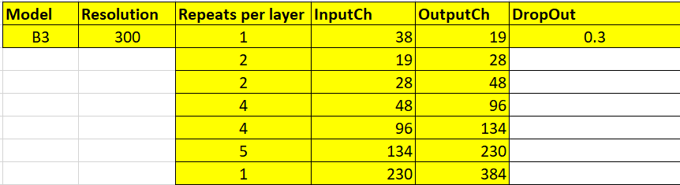
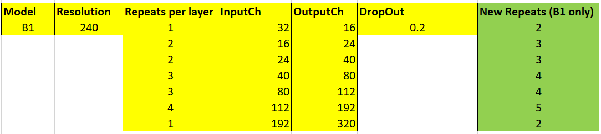
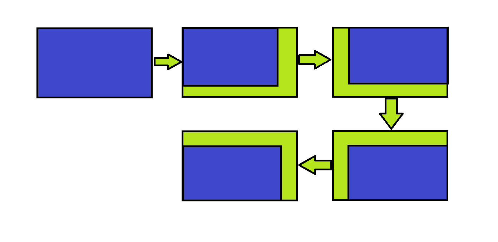
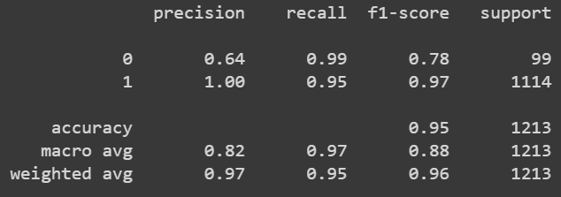
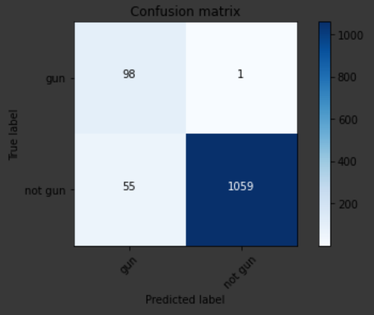

# CS302-Python-2020-Group32
# Table of contents
- [Instructions](#instructions)
- [Gun detection system](#gun-detection-system)
- [Model](#model)
- [Database](#database)
- [Evaluation](#evaluation)
- [Conclusion & Future Work](#conclusion--future-work)

# Instructions
Below are the steps to be taken when using our code:

1. Choose project file(s) to download
    * We have 4 model files: **B0 with AveragePool5, B0 with MaxPool, B0 with AveragePool9, and B1 without DropOut** 
2. Download dataset
    * our dataset can be downloaded from the following link: [dataset]()
3. Put project files and dataset folder in the same directory
    * please ensure you extract all .zip files
4. Navigate to directory in console and run desired file

Note: Please ensure that you have a CUDA enabled GPU for training. Also ensure that you have TensorBoard installed, as our code uses TensorBoard for extra evaluation functionality.

Please find the links to our scripts below:
* [B0 with AveragePool5]()
* [B0 with MaxPool]()
* [B0 with AveragePool9](/B0_AvgPool9.py)
* [B1 without DropOut](/B1_without_DropOut.py)

# Gun detection system

Mass shootings are an unfortunate reality in today's world. Stopping mass shootings have proven to be extremely difficult without drastic and extreme measures. We aim to develop a deep-learning-based solution that will help reduce casualties from shootings through early detection and reporting. 

The purpose of our planned system will be to detect guns in videos/surveillance footage and raise an alarm or notify authorities and affected persons if the need arises. Although outside of the scope of this project, our system should be accurate and precise enough to allow for active protection systems to act on our data.

Our planned system will detect guns in a given image/frame and attempt to create a bounding box around any detected guns. However, it should be noted that for the purposes of this project we will focus more on detection than on bounding boxes, so the bounding boxes drawn by our model may not be as accurate as our model's detection accuracy.

# Model
## Overview
We plan to use the EfficientNet architecture to detect guns in real-time. EfficientNet is an architecture that takes advantage of compound scaling (i.e. scaling in Depth, Width and Resolution dimensions) to achieve state-of-the-art accuracy with lower FLOPS and less parameters than models that scale a single dimension. A key point in the original development of this architecture was that the efficiency and accuracy of the model when scaled depends on how much you scale each dimension w.r.t each other. Therefore, the scaling factors (α, β and γ) can be found for the best results when using EfficientNet. Our scaling factors were taken from those used by other implementations. Another key feature of this model that was particularly attractive to us was the low inference times - an important factor to consider when making a gun detector.

Below is a representation of our basal model (EfficientNet B0) without any scaling from the original documentation:

## Key features
When developing our model, we had implement the following key features
* Data transforms
* Data loaders
* Swish activation
* MBConv layer
  - Inverted Residual Block
  - Squeeze and Excitation
  - Dropout layer

### Data transforms and Data loaders
These features of our model are self-explanatory. They define the transformations we will do to our data, and the directory from which our data is to be downloaded. The code then downloads the images and labels of each class and splits them into training and validation data.

### Swish activation
Swish activation is defined as **σ(x) × x**. That is, the sigmoid of x, multiplied by x. The Swish activation function, while it looks similar to the ReLU function, is smooth (i.e. it does not abruptly change its value like ReLU does at x = 0). A graph of this function can be seen below:

The reason behind using Swish activation for EfficientNet is because it was said to provide better results than ReLU from both the *EfficientNet: Rethinking Model Scaling for Convolutional Neural Networks paper* by *Mingxing Tan and Quoc V. Le* as well as a Google Brain study from 2017 by *Ramachandran et al.*. Theoretically, unlike ReLU, Swish does not discard values below 0, hence reducing information loss. Note that the Swish activation was not used solely for MBConv layers, but also for the 
and 3x3 convolutional layers.

These papers can be found at the following links:
* Tan et al.: <https://arxiv.org/pdf/1905.11946.pdf>
* Ramachandran et al.: <https://arxiv.org/pdf/1710.05941v1.pdf>

### MBConv layers
The MBConv layer is the largest component in our EfficientNet implementation. Basically, it is a convolutional layer with Inverted residuals, Squeeze and Excitation, as well as Dropout. These three modules of MBConv are explained below:

#### Inverted Residuals
Inverted residuals firstly have a skip connection, or residual, allowing information and gradients to pass through the block. This allows for deeper models by easing the shrinking of gradients as the model becomes deeper, and also reduces loss of finer information in the earlier layers of the model. The Inverted residual uses another important idea, the 1x1 convolution (pointwise convolution). This convolution expands/decreases the number of feature maps, rather than the resolution. This allows the inverted residual block to increase the feature mapping into a higher dimension at the start of the block. This is so that non-linear activations can be applied within a expanded higher dimension of feature mappings. 

Non-linear activations are essential for neural networks, but can lose information, especially in lower dimensions. The non-linear activation being applied in a higher number of dimensions mitigates the information loss effect. Additionally, depthwise separable convolutions are applied, where convolutions are applied on indiviudal feature map layers. Afterwards, the 1x1 convolution is re-applied to shrink the number of feature mappings, and at the same time achieve spatial feature mapping. The linear output is then added to the skip connection. The use of a depthwise seperable convolution increases efficiency by an order of magnitude, by reducing the number of parameters convolved. 

#### Squeeze and Excite
Squeeze and Excite blocks work by *squeezing* an input using Global Average Pooling to the shape  (1, 1, *feature maps*) and multiplying this back to the input. Multiplying the (1, 1, *feature maps*) tensor back to the input increases the weighting of feature maps that have more features, thus '*exciting*' the weightings.

Our implementation of Squeeze and Excite in PyTorch uses the following layers:
* AdaptiveAvgPool2d - this layer computes the (1, 1, *feature maps*) tensor through global average pooling
* Conv2d with ReLU activation - this layer adds non-linearity and reduces output channel complexity
* Conv2d with Sigmoid activation - this layer gives the channel a smooth gating function

The output of the above layers is then multiplied to the input tensor.

#### Dropout layer
The Dropout layer in our implementation works by randomly choosing nodes to deactivate at the end of an MBConv block (does not apply for all the layers, only the ones that are repeated). We chose to add this functionality to our MBConv layers because it helps mitigate the risk of the model 'memorising' data, and allows for building new and better connections in the network.

In our testing we attempted two methods of implementing a Dropout layer: we tried using the built-in Pytorch Dropout layer as well as making our own function to randomly choose nodes to drop out. Interestingly, our tests showed that our function outperformed the built-in layer when used in our model. As a result of this testing, we decided upon continuing the use of the function rather than the PyTorch layer for our model.

## Scaling
We used some common scaling factors and other parameters (such as input channels, output channels, and repeats to name a few) to create an Excel sheet that will allow us to calculate the specific parameter to be changed for each model. This allowed us to quickly test different versions of EfficientNet, as the parameters to be changed in each scaled model could be easily found. We were also able to make quick changes to the scaling calculations to test out results from different scaling factors and/or rounding techniques. Examples from our Excel sheet are shown below:

B3 model:

B1 model (with repeats in raw form, and an extra column with all repeats rounded up):

The Excel sheet can be found [here](https://drive.google.com/open?id=1trUOhY_HJaVsSx8iwTS-0O_F2NpxE4cJ) (Please download before using)

## Training, Fine-tuning and Optimisation

Over the course of this project we have trained various versions of EfficientNet with different optimisers, learning-rate schedulers, different datasets, and differing numbers of epochs.

The optimisers that we have tested are the Adam optimiser and the Stochastic Gradient Descent (SGD) optimiser. Initially, we were expecting the Adam optimiser to outperform SGD in our tests. However, SGD suprisingly had better convergence than Adam. As a result, we chose to continue testing SGD. During our tests with SGD, we began experimenting with the use of *Nesterov momentum*.

Nesterov Momentum is a variant of SGD that speeds up training and improves convergence. It basically calculates the gradient term from an intermediate point rather than the current position. This allows for corrections to be made if the momentum overshoots the next point or is pointing in the incorrect direction. See more [here](https://dominikschmidt.xyz/nesterov-momentum/).

In our testing with Nesterov momentum, we found that a momentum of 0.5 works well with our EfficientNet models.

In terms of epoch testing, we have trained our models for varying numbers of epochs ranging from 40 to 224. We found that while our training accuracy percentage easily manages to reach the high 90s within around 40-80 epochs, we needed to train for more epochs in order for our validation accuracy to be similarly as good.

We also found that the use of PyTorch's *ReduceLROnPlateau* learning rate scheduler was useful when our model plateaus at a particular validation metric for 15 epochs.

## Extra features
In addition to our EfficientNet model, we decided to create a bounding box algorithm to daw boxes around any guns that we detect. This algorithm works alongside our model, but is not actually part of the model itself. Our bounding box algorithm works by way of taking sections from an image contianing a detected gun and using a 'sliding window' to check for where in that section a gun may be.

The positions of our sliding window in each input image are as shown below:

(Note: blue is the area of the sliding window, green is the image. Inititally, the program checks the entire image to ensure there is a gun in the input)

After one round of the above sequence, the algorithm checks if the probabilities for guns in any of the boxes are greater than the threshold probability (which is updated to the highest probability found at the end of each sequence). If there is a higher probability, then the section of the image covered by the sliding window for the hisghest probability will become the input to the algorithm and so on. Eventually, the coordinates of the sliding window with the highest probability will become the coordinates of the bounding box.

An example of the boundinb box algorithm's result can be seen below:

# Database

Our dataset is a custom dataset containing images from Google Images, Gun Wiki, a Synthetic Gun Dataset, COCO and CIFAR10. We have two classes in our dataset, namely *gun* and *not gun*. The *gun* class will contain a combination of gun images from Google, Gun Wiki and the Synthetic Gun Dataset. The *not gun* class will contain a combination of random images from COCO and/or CIFAR10. Each class will have an equal amount of images, with the total number of images being *12,250*. This dataset will be further split into training and validation sets. For testing, we have a created a separate set of images (including images from Atulya Kumar's dataset) that were not used in our training or testing data. However, our main plan of action is to do real-time testing through a webcam using printouts of gun images.

The reason behind having two classes rather than just a gun class is that we do not want our model to learn that it can get the correct answer by always predicting there is a gun. This would defeat the purpose of the project because the model would predict a large number of *false positives*.

However, we believe that we need an equal amount of images in each class (i.e. *balanced* dataset) is to mitigate the chance of our model being biased to either class. This is because, while we do not want our model to guess gun every time, we also do not want it to be biased to the *not gun* class either.

Links to databases used (does not include Gu wiki or Google images):
* [Sai Sasank's dataset](https://www.kaggle.com/issaisasank/guns-object-detection)
* [Synethetic dataset](https://docs.google.com/forms/d/e/1FAIpQLSffVbLwfuhgSvwxrU66NDTZLfz0RrqcQ-KXJxEN9HIZiqxBeg/viewform?vc=0&c=0&w=1)
* [Atulya Kumar's dataset](https://www.kaggle.com/atulyakumar98/gundetection)
* [COCO](http://cocodataset.org/#download)
* [CIFAR10](https://www.cs.toronto.edu/~kriz/cifar.html)

# Evaluation

Our final four models were limited to using variations of B0 and B1 models as we were limited in terms of time and hardware. The models we have used are outlined below:

Models               | Dataset
---------------------|------------------------
B0 with AveragePool5 | synthetic + real images
B0 with MaxPool      | synthetic + real images
B0 with AveragePool9 | synthetic + real images
B1 without DropOut   | synthetic + real images

The results and evaluation for each model are outlined below:

### B0 with AveragePool (5x5 kernel)

### B0 with MaxPool

### B0 with AveragePool (9x9 kernel)

 

### B1 without DropOut

From the results above, we can see that the B0 model with AveragePool5 (i.e. average pooling with a 5x5 kernel) performed the best out of all four models. A large part of this can be attributed to the use of Average Pooling rather than Max Pooling, as seen from the results of the B0 with Max Pooling. Surprisingly, the B0 with AveragePool9 actually performed worse than the AveragePool5- contrary to what we were expecting. Perhaps the reasoning is the difference in epochs each was trained for. The AveragePool9 model could not have been trained for as long due to usage limits in Google Colaboratory. The B1 without the use of a Dropout layer performed worst of all, and this goes to show how important the dropout layer was for our model's ability to generalise rather than memorise features in the training phase.

# Conclusion & Future Work
From working on this project, we have learnt/reinforced many concepts and theories, as well as developed a feel for fine-tuning and tweaking features of a model to improve its convergence and overall performance. We have also developed our use and understanding of evaluation tools such as TensorBoard, Confusion Matrices, Precision, Recall, and F1 metrics. All these skills have allowed us to create an EfficientNet model that can accurately detect guns in images/video frames. However, though we have completed this project for the purposes of COMPSYS302, we believe that there is more we can do to improve our model.

Our future aims for this project are as follows:
* Use larger models ranging from B3 to B7
* Use our full dataset; Maybe collate more images for use in this dataset
* Improving inference times of our models
* Improve the accuracy of our bounding box system
* Improving speed of bounding box generation
* Finding better scaling factors that are better suited to our use case

