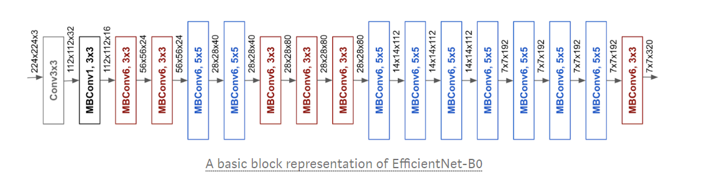

# CS302-Python-2020-Group32
# Gun detection system

Mass shootings are an unfortunate everyday reality in today's world. Stopping mass shootings have proven to be extremely difficult without drastic and extreme measures. We aim to develop a deep-learning-based solution that will help reduce casualties from shootings through early detection and reporting. 

The purpose of our planned system will be to detect guns in videos/surveillance footage and raise an alarm or notify authorities and affected persons if the need arises. Although outside of the scope of this project, our system should be accurate and precise enough to allow for active protection systems to act on our data.

Our planned system will detect guns in a given image/frame and attempt to create a bounding box around any detected guns. However, it should be noted that for the purposes of this project we will focus more on detection than on bounding boxes, so the bounding boxes drawn by our model may not be as accurate as our model's detection accuracy.

# Model

We plan to use the EfficientNet architecture to detect guns in real-time. EfficientNet is an architecture that takes advantage of compound scaling (i.e. scaling in Depth, Width and Resolution dimensions) to achieve good accuracy with lower FLOPS and less parameters than models that scale a single dimension. A key point in the original development of this architecture was that the efficiency and accuracy of the model when scaled depends on how much you scale each dimension w.r.t each other. Therefore, the scaling factors (α, β and γ) can be found for the best results when using EfficientNet. Our scaling factors were taken from those used by other implementations.

Below are two representations of our basal model (EfficientNet B0) without any scaling

We used the scaling factors and other parameters (such as input channels, output channels, and repeats to name a few) to create an Excel sheet that will allow us to calculate the specific parameter to be changed for each model. This allowed us to test

# Database
