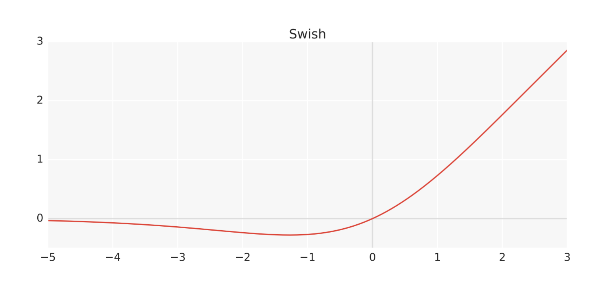

# CS302-Python-2020-Group32
# Gun detection system

Mass shootings are an unfortunate everyday reality in today's world. Stopping mass shootings have proven to be extremely difficult without drastic and extreme measures. We aim to develop a deep-learning-based solution that will help reduce casualties from shootings through early detection and reporting. 

The purpose of our planned system will be to detect guns in videos/surveillance footage and raise an alarm or notify authorities and affected persons if the need arises. Although outside of the scope of this project, our system should be accurate and precise enough to allow for active protection systems to act on our data.

Our planned system will detect guns in a given image/frame and attempt to create a bounding box around any detected guns. However, it should be noted that for the purposes of this project we will focus more on detection than on bounding boxes, so the bounding boxes drawn by our model may not be as accurate as our model's detection accuracy.

# Model
## Overview
We plan to use the EfficientNet architecture to detect guns in real-time. EfficientNet is an architecture that takes advantage of compound scaling (i.e. scaling in Depth, Width and Resolution dimensions) to achieve good accuracy with lower FLOPS and less parameters than models that scale a single dimension. A key point in the original development of this architecture was that the efficiency and accuracy of the model when scaled depends on how much you scale each dimension w.r.t each other. Therefore, the scaling factors (α, β and γ) can be found for the best results when using EfficientNet. Our scaling factors were taken from those used by other implementations.

Below is a representation of our basal model (EfficientNet B0) without any scaling from the original documentation:

## Key features
When developing our model, we had implement the following key features
* Data transforms
* Data loaders
* Swish activation
* MBConv layer
  - Inverted Residual Block
  - Squeeze and Excitation
  - Dropout layer

### Data transforms and Data loaders
These features of our model are self-explanatory. They define the transformations we will do to our data, and the directory from which our data is to be downloaded. The code then downloads the images and labels of each class and splits them into training and validation data.

### Swish activation
Swish activation is defined as **σ(x) × x**. That is, the sigmoid of x, multiplied by x. The Swish activation function, while it looks similar to the ReLU function, is smooth (i.e. it does not abruptly change its value like ReLU does at x = 0). A graph of this function can be seen below:

The reason behind using Swish activation for EfficientNet is because it was said to provide better results than ReLU from both the *EfficientNet: Rethinking Model Scaling for Convolutional Neural Networks paper* by *Mingxing Tan and Quoc V. Le* as well as a Google Brain study from 2017 by *Ramachandran et al.*. Theoretically, un-like relu, swish does not discard values below 0, hence reducing information loss. Note that the Swish activation was not used solely for MBConv layers, but also for the 
and 3x3 convolutional layers.

These papers can be found at the following links:
* Tan et al.: <https://arxiv.org/pdf/1905.11946.pdf>
* Ramachandran et al.: <https://arxiv.org/pdf/1710.05941v1.pdf>

### MBConv layers
The MBConv layer is the biggest component in our EfficientNet implementation. Basically, it is a convolutional layer with Inverted residuals, Squeeze and Excitation, as well as Dropout. These three modules of MBConv are explained below:

#### Inverted Residuals
Inverted residuals firstly have a skip connection, or residual, allowing infomration and gradients to pass the block. This both enables deeper models by easing the shrinking of gradients as the model becomes deeper, but also reduces finner information being lost in the first layers of the model. The Inverted redisual uses another important idea, the 1x1 convolution. This convolution expands/decreases the number of feature maps, rather than resolution. This allows for the inverted residual block to increase the feature mapping into a higher dimension at the start of the block. This is so that non-linear activations can be applied within a expanded higher dimension of feature mappings. Non-linear activations are essential for neural networks, but can lose information, especially in lower dimensions. The non-linear activation being applied in a higher number of dimensions mitigates the informatin loss effect. Afterwards, the 1x1 convolution is reapplied to shrink the number of feature mappings. Then the linear output is added to the skip connection. The reason for expanding then compressing the feature map dimension is to reduce the number of parameters passed in the skip connection, increasing model efficiency. 

#### Squeeze and Excitation
Squeeze and Excite blocks work by *squeezing* an input using Global Average Pooling to the shape  (1, 1, *feature maps*) and multiplying this back to the input. Multiplying the (1, 1, *feature maps*) tensor back to the input increases the weighting of feature maps that have more features, thus '*exciting*' the weightings.

Our implementation of Squeeze and Excite in PyTorch uses the following layers:
* AdaptiveAvgPool2d - this layer computes the (1, 1, *feature maps*) tensor through global average pooling
* Conv2d with ReLU activation - this layer adds non-linearity and reduces output channel complexity
* Conv2d with Sigmoid activation - this layer gives the channel a smooth gating function

The output of the above layers is then multiplied to the input tensor.

#### Dropout layer
The Dropout layer in our implementation works by randomly choosing nodes to deactivate at the end of an MBConv block (does not apply for all the layers, only the ones that are repeated). We chose to add this functionality to our MBConv layers because it helps mitigate the risk of the model 'memorising' data, and allows for building new and better connections in the network.

## Scaling
We used the scaling factors and other parameters (such as input channels, output channels, and repeats to name a few) to create an Excel sheet that will allow us to calculate the specific parameter to be changed for each model. This allowed us to quickly test different versions of EfficientNet, as the parameters to be changed in each scaled model could be easily found. We were also able to make quick changes to the scaling calculations to test out results from different scaling factors and/or rounding techniques. Examples from our Excel sheet are shown below:

B3 model:

B1 model (with repeats in raw form, and an extra column with all repeats rounded up):

The Excel sheet can be found [here](https://drive.google.com/open?id=1RvCSW4h4D8sd5r17Tcftie6pmOvOUVz1) (Please download before using)

## Training, Fine-tuning and Optimisation

Over the course of this project we have trained various versions of EfficientNet with different optimisers, learning-rate schedulers, and differing numbers of epochs.

The optimisers that we have tested are the Adam optimiser and the Stochastic Gradient Descent (SGD) optimiser. Initially, we were expecting the Adam optimiser to outperform SGD in our tests. However, SGD suprisingly had better convergence than Adam. As a result, we chose to continue testing SGD. During our tests with SGD, we began experimenting with the use of *Nesterov momentum*.

Nesterov Momentum is a variant of SGD that speeds up training and improves convergence. It basically calculates the gradient term from an intermediate point rather than the current position. This allows for corrections to be made if the momentum overshoots the next point or is pointing in the incorrect direction. See more [here](https://dominikschmidt.xyz/nesterov-momentum/).

In our testing with Nesterov momentum, we found that a momentum of 0.5 works well with our EfficientNet models.

In terms of epoch testing, we have trained our models for varying numbers of epochs ranging from 40 to 224. We found that while our training accuracy percentage easily manages to reach the high 90s within 40 epochs, we needed to train for more epochs in order for our validation accuracy to be similarly as good. ***Needs more info***

# Database

Our dataset is a custom dataset containing images from Google Images, Gun Wiki, a Synthetic Gun Dataset, COCO and CIFAR10. We have two classes in our dataset, namely *gun* and *not gun*. The *gun* class will contain a combination of gun images from Google, Gun Wiki and the Synthetic Gun Dataset. The *not gun* class will contain a combination of random images from COCO and/or CIFAR10. Each class will have an equal amount of images, with the total number of images being ***Insert number here***. 

The reason behind having two classes rather than just a gun class is that we do not want our model to learn that it can get the correct answer by always predicting there is a gun. This would defeat the purpose of the project because the model would predict a large number of *false positives*.

The reason behind having equal amount of images in each class is to mitigate the chance of our model being biased to either class.

Some examples of guns from our dataset are:

***Insert images here***

